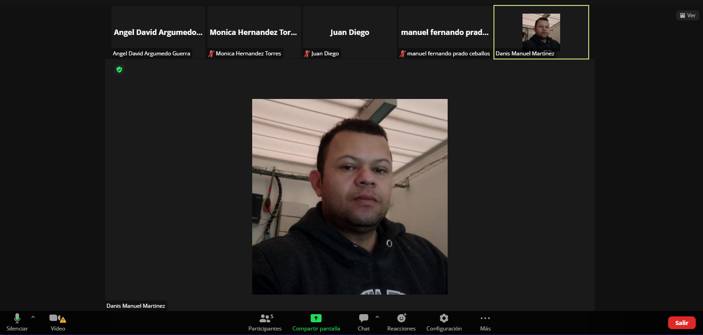
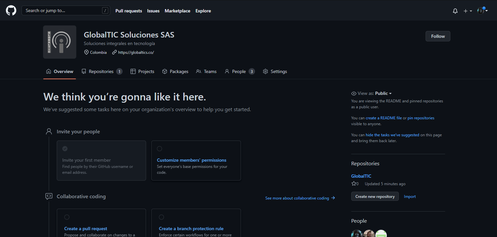

# Sprint 1

Esta es una prueba donde cada integrante sube un commit al repositorio.


# Screenshot





# Documentos

Cada integrante debe subir un commit de lo que quiera.

comandos de git
```shell
git init

git add .

git commit -m "first commit"

git remote add origin https://github.com/NOMBRE_USUARIO/NOMBRE_PROYECTO.git

git push -u origin master
```

# Enviroments
en este caso no poseemos variables de entorno
- `github` Prueba


# Recursos

- [Materia Bootswatch](https://www.bootstrapcdn.com/bootswatch/)
- [CSS Background uiGradients](https://uigradients.com/#Dull)

# Information aditional

Este repositorio fue creado con fines educativos.